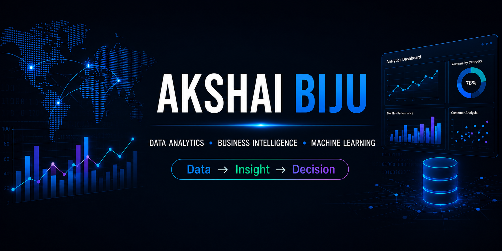

  

---

## 👨‍💻 About Me

I'm a Data Analyst based in Ontario, Canada, with a background in Artificial Intelligence, Big Data Analytics, and software engineering.

- 📊 I work with **Python, SQL, Excel, Power BI, and data visualization**
- 🤖 Interested in **Machine Learning, AI, and intelligent data solutions**
- 🧪 Experience with **software testing and QA automation**
- 🔍 I enjoy transforming complex datasets into clear, actionable insights
- 🌱 Currently expanding my portfolio through real-world analytics and AI projects
- 💼 Open to opportunities in **Data Analytics, Business Intelligence, AI, and QA Automation**

---

## 🛠️ Technical Skills

### 📊 Data Analytics & BI

### 🗄️ Databases

### 🤖 Machine Learning & AI

### 🧪 Testing & Development

---

## 🚀 Featured Projects

I'm currently rebuilding my project portfolio with end-to-end data analytics, machine learning, and AI projects.

**Projects coming soon.**

---

## 🤝 Connect With Me

💼 LinkedIn: linkedin.com/in/akshai-biju

📍 Ontario, Canada
